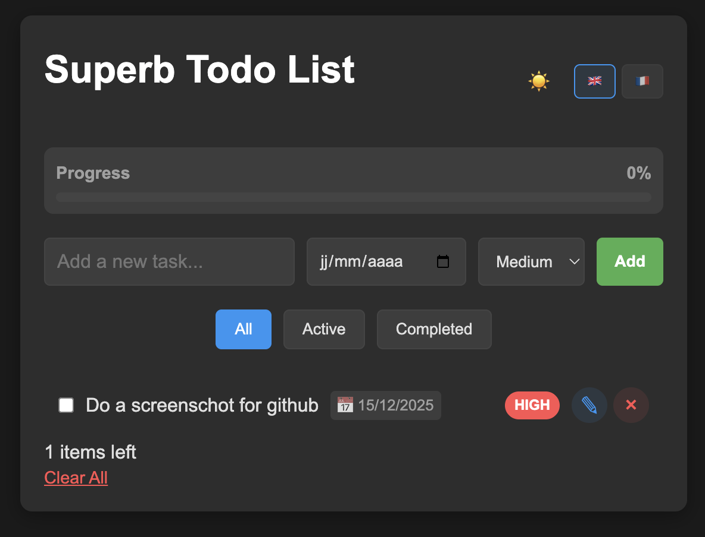

# 🚀 Superb Todo List

A modern, feature-rich Todo List application built with **Vue 3** and **Vite**. Designed to be fast, responsive, and user-friendly.


## ✨ Features

- **📝 Smart Task Management**: Add tasks with priorities (Low, Medium, High) and optional deadlines.
- **🌗 Dark Mode**: Fully supported dark theme that persists across sessions.
- **🌍 Internationalization (i18n)**: Switch instantly between English 🇬🇧 and French 🇫🇷.
- **💾 Auto-Save**: Your tasks and preferences are automatically saved to LocalStorage.
- **✏️ Inline Editing**: Double-click any task to edit its text or deadline directly.
- **📊 Progress Tracking**: Visual progress bar to keep you motivated.
- **📱 Responsive Design**: Works perfectly on desktop and mobile devices.
- **⚡️ Smart Sorting**: Tasks are automatically sorted by priority and completion status.

## 🛠️ Tech Stack

- **Framework**: Vue 3 (Composition API, `<script setup>`)
- **Build Tool**: Vite
- **Styling**: Native CSS3 with CSS Variables (Custom Properties)
- **State Management**: Vue Reactivity System (`ref`, `computed`)

## 🚀 Getting Started

### Prerequisites

- Node.js (v16 or higher)
- npm or yarn

### Installation

1. Clone the repository:

   ```sh
   git clone https://github.com/yourusername/todo-list.git
   cd todo-list
   ```

2. Install dependencies:

   ```sh
   npm install
   ```

3. Start the development server:

   ```sh
   npm run dev
   ```

4. Open your browser at `http://localhost:5173`

## 📸 Screenshots



## 📄 License

This project is open source and available under the [MIT License](LICENSE).
